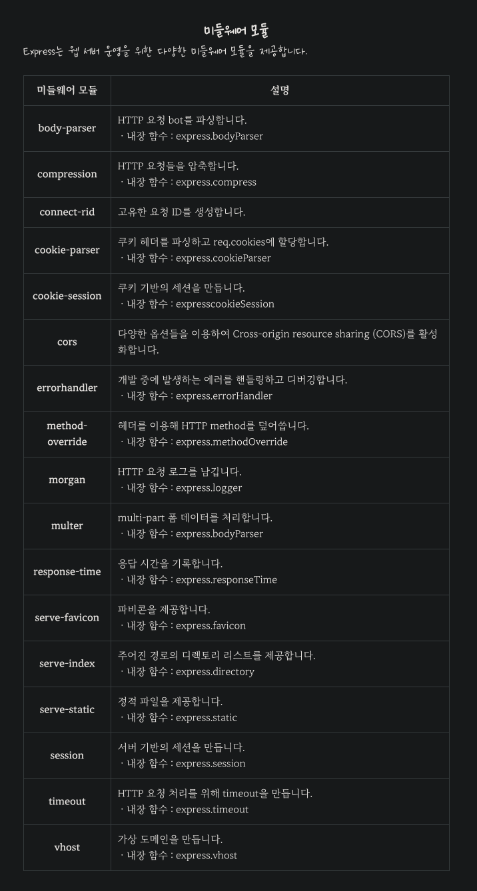

# Express 서버 구축 (feat. Javascript)

<p style="color:red; font-size:30px">  꼭 Webstorm에서 개발하기! 안그러면 타입 관련 힌트를 받을수 없음! </p>

또는 `@types`로 타입들이 정의된 d 파일을 가져온다면 vscode에서도 사용할수 있다.

## Express 설치

다음 명령어로 express를 설치 할수 있다.

```bash
yarn add express [@types/express]
```

Typescript에서 사용하려면 `@types/express`를 추가하면 된다.

## Express에서 사용하는 미들웨어들

- 데이터 파싱 : body-parser 미들웨어

- 데이터 압축 : compression 미들웨어

- 쿠키 관리 : cookie-parser 미들웨어

- 쿠키 세션 : cookie-session 미들웨어

- 세션 관리 : express-session 미들웨어

- CORS 관리 : cors 미들웨어

- 로깅 관리 : morgan 미들웨어

- 파일 업로드 : multer 미들웨어

- 코드 실행 시간 측정 : response-time 미들웨어

- 타임아웃 설정 : connect-timeout 미들웨어


