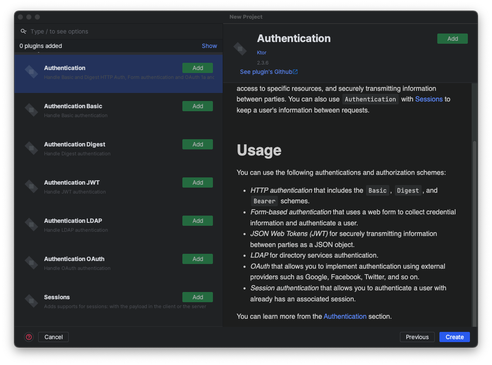
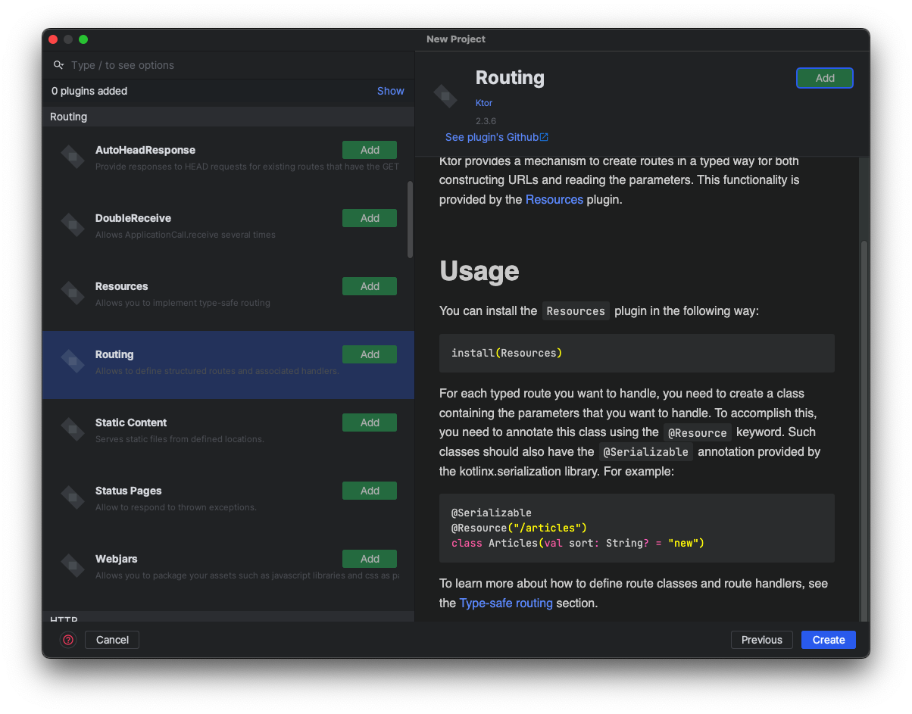
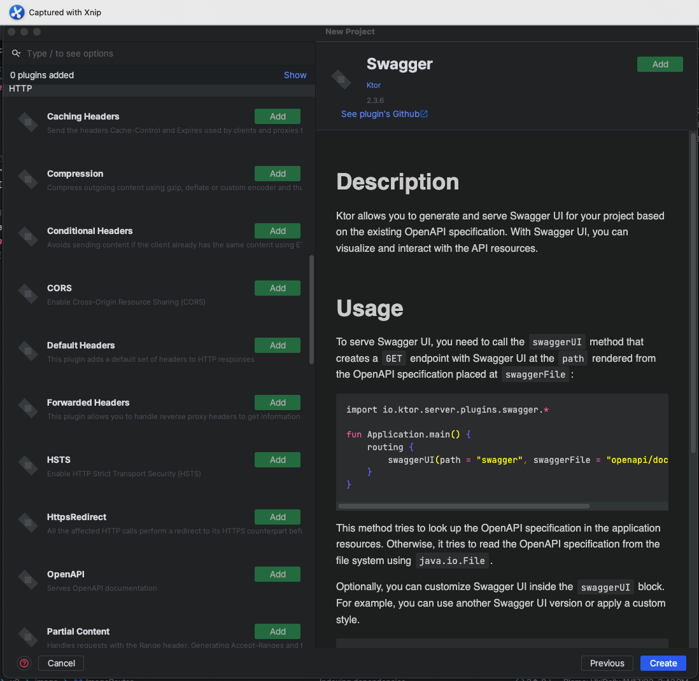
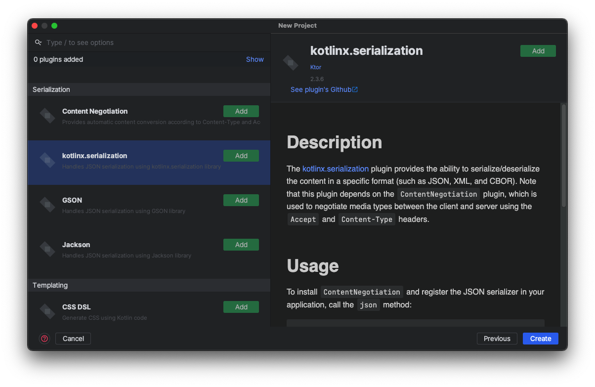

# Ktor 프로젝트를 시작할때 필수로 해야하는 세팅들

## 프로젝트 생성시 추가할 플러그인

필수 플러그인들은 볼드체로 추가함

### 1. `Authentication`



`Authentication`은 `Basic` , `JWT`, `Session`등을 포함한 번들 플러그인이다. 전부 필요하면 추가하고 아니라면 필요한 부분만 추가하도록

---

### 2. `Routing`



- **Routing**

Routing은 라우팅을 위해 추가해야할 필수 플러그인인다.

- **Resources**

Resources은 라우팅을 문자열이 아닌, `class` 형태로 관리할수 있게 해주는 플러그인으로, query param, path param도 type safe하게 관리 할수 있기 때문에 추가하는 편이 좋다.

- Static Content

Static Content는 정적 파일을 서빙할 수 있도록 해주는 플러그인이며, 풀스택 웹서버를 개발할때 추가하면 좋다.

- **Status Page**

서버에서 발생하는 `Exception`을 한곳에 모아서 관리 할수 있도록 해주며, 각 Exception에 따라 원하는 응답을 전송할수 있도록 해주는 플러그인이다.

### 3. `HTTP`



헤더 및 여러 HTTP 관련 플러그인

- **Swagger**

Swagger UI를 사용할수 있게 해주는 플러그인이다. Api 명세서를 작성할때 아주 좋으므로 추가하는데 좋다. 하지만 제대로 사용하기 위해서는 `CORS` 플러그인도 추가해야한다.

### 4. `Serialization`

json 역/직렬화 관련 플러그인



- **Content Negotiation**

자동으로 Json 역/직렬화를 하기 위해선 필수로 넣어야하는 플러그인

- **kotlinx.serialization**

코틀린의 기본 직렬화 플러그인. 웬만한 상황에서 사용하기 좋다. `Exposed`를 사용하면 필수로 넣어야한다.

### 5. `Database`

DB에 접근하는 ORM 플러그인, RDBMS 계열의 DB를 사용하면 `Exposed`이나 `Ktorm`같은 플러그인을 사용하는게 좋다.

- **Exposed**

Kotlin에 특화된 ORM 플러그인이다. RDBMS 데이터베이스를 사용하면 거의 필수로 사용. 모든 기능을 사용하기 위해선 다음과 같이 추가로 `gradle`파일에 추가해야한다.

```gradle
dependencies {
  ...
  implementation("org.jetbrains.exposed:exposed-dao:{버전}")
  implementation("org.jetbrains.exposed:exposed-jdbc:{버전}")
  implementation("org.jetbrains.exposed:exposed-java-time:{버전}")
  // Hikari를 사용하고 싶을때 함께 추가
  implementation("com.zaxxer:HikariCP:{버전}")
  ...
}
```

- Ktorm

Ktorm는 Exposed과 같은 ORM 라이브러리이다. 하지만 차이점이 존재한다. Exposed는 DB에 직점 스키마를 넣을수 있지만 Ktorm는 불가능하다.

### 6. `Dependency Injection`

코틀린에서는 object 키워드를 통해 싱글톤 객체를 구현할 수 있지만 DI 프레임워크를 사용하는게 좋다.

- **Koin**

```gradle
implementation("io.insert-koin:koin-ktor:{버전}")
implementation("io.insert-koin:koin-ksp-compiler:{버전}")
runtimeOnly("io.insert-koin:koin-annotations:{버전}")
```
